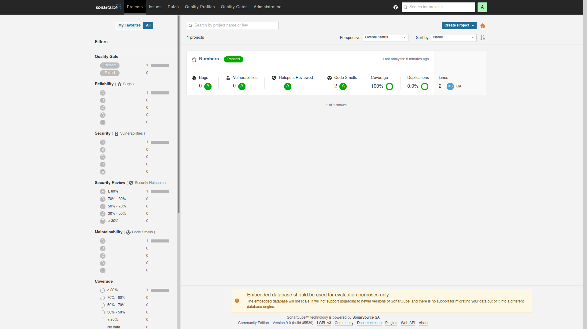
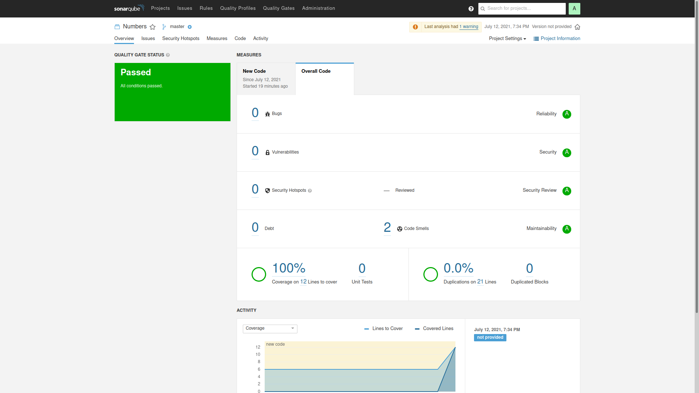

<p align="center" style="font-size: 36px">
  Unit Testing Code Coverage with coverlet and sonarqube
</p>
<p align="center">
  

  

  <a href="https://www.twitter.com/daniel_leal1/">
    
  </a>

  <a href="https://github.com/daniel-leal/letmeask/commits/master">
    
  </a>

   
   <a href="https://github.com/daniel-leal/letmeask/stargazers">
    
  </a>
</p>

<h4 align="center">
	 Status: Finished
</h4>

<p align="center">
 <a href="#about">About</a> •
 <a href="#author">Author</a> •
 <a href="#user-content-license">License</a>

</p>

## About Project

💡 This is a study project. The main purpose is use as template for .net core projects test coverage.

---

## Sonar DEMO

<p align="center" style="display: flex; align-items: flex-start; justify-content: center; gap: 8px;">
  
  
</p>

---

### Pre-requisites

Before you begin, you will need to have the following tools installed on your machine:
[Git](https://git-scm.com), [Node.js](https://nodejs.org/en/).
In addition, it is good to have an editor to work with the code like [VSCode](https://code.visualstudio.com/)

#### Running Project

```bash

# Clone this repository
$ git clone git@github.com:daniel-leal/UnitTestingCodeCoverageSonar.git

# Access the project folder cmd/terminal
$ cd UnitTestingCodeCoverageSonar

# install the dependencies
$ dotnet restore

# Run the tests
$ dotnet test

# Run to sonar qube
# <Don`t forget to Edit sonarqube.sh url path>
$ sh sonarqube.sh

```

---

## How to contribute

1. Fork the project.
2. Create a new branch with your changes: `git checkout -b my-feature`
3. Save your changes and create a commit message telling you what you did: `git commit -m" feature: My new feature "`
4. Submit your changes: `git push origin my-feature`

---

## Author

 
 <br />
 <sub><b>Daniel Leal</b></sub>
 <br />

[](https://twitter.com/daniel-leal) [](https://www.linkedin.com/in/daniel-leal/)
[](mailto:daniel-leal@gmail.com)

---

## License

This project is under the license [MIT](./LICENSE.md).

Made with ❤ by Daniel Leal 👋🏽 [Get in Touch!](https://www.linkedin.com/in/daniel-borges-leal-58198087/)
